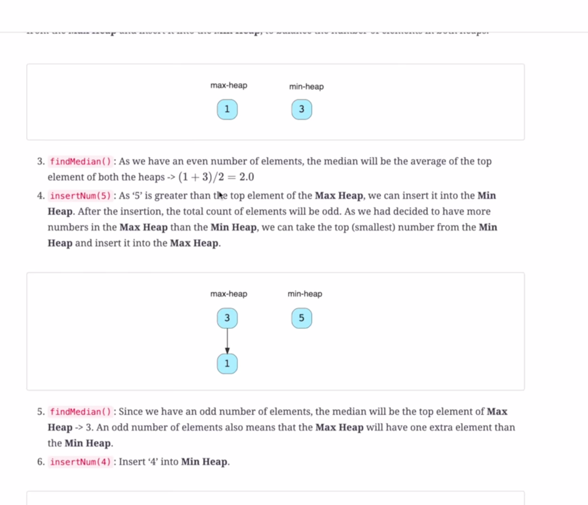

Approach

    1.use 2 heaps maxHeap and minHeap where maxHeap stores the largest element of the left half of array at the top and minHeap store the smallest element of right half at the top

    2.We make sure that all elements smaller to maxHeap.top() are lying in maxHeap and similarly all elements larger than minHeap.top() are in minHeap

    3.If any of the 2 heaps size gets more we handle them separately

For more understanding click [here](https://www.youtube.com/watch?v=Yv2jzDzYlp8)

