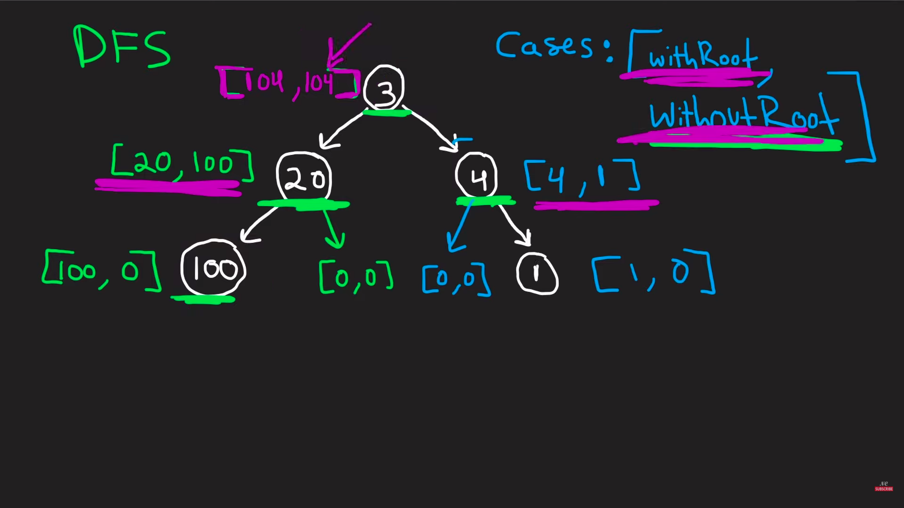

Approach

    1.The maximum value that we can get is the maximum of 2 values 

    2.first is when we are including the root and second is when we are not including the root

    3.We do a dfs traversal of the tree and at any node we compute 2 values one including that node and one without including that node

    4.The value including that node is the sum of value at that node and the sum of values of its left and right subtree without including them(i.e second value of pairs of both left and right subtree)

    5.The value without including that node is the maximum of all 4 values i.e left.first,left.second,right.first and right.second

    6.At the end we return the maximum of both left and right value of the pair that is returned to the root node

    7.The below image gives better understanding of the above approach

