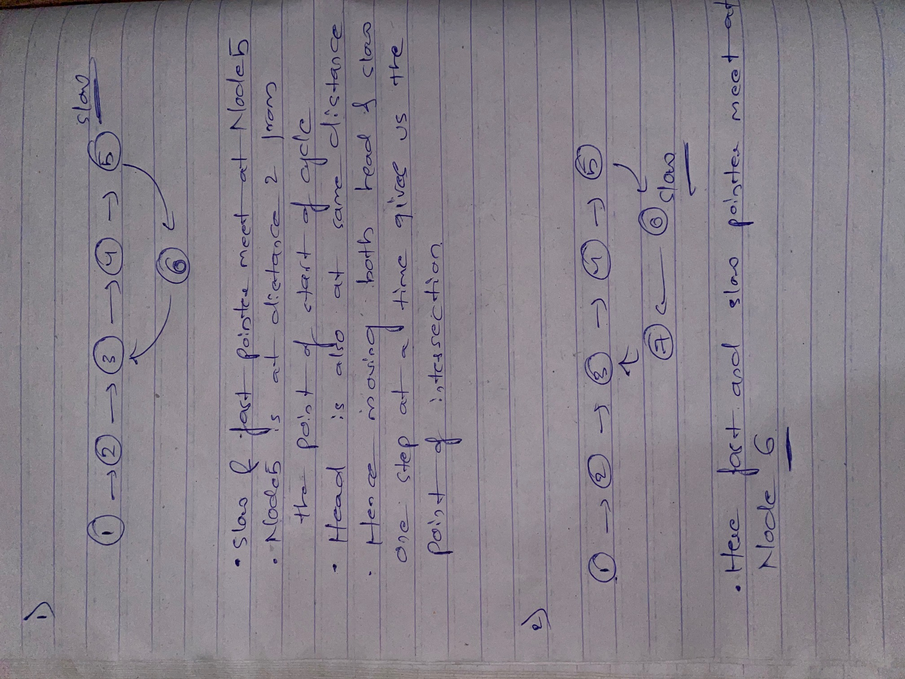

Approach

    1.Using the 2 pointer approach we find if there exists a cycle in our list

    2.Initialise 2 pointers slow and fast, slow moves one step at a time and fast moves 2 steps

    3.It is guarenteed that the distance of point of intersection of slow and fast pointers from the start of cycle is same 

    as its distance from the head

