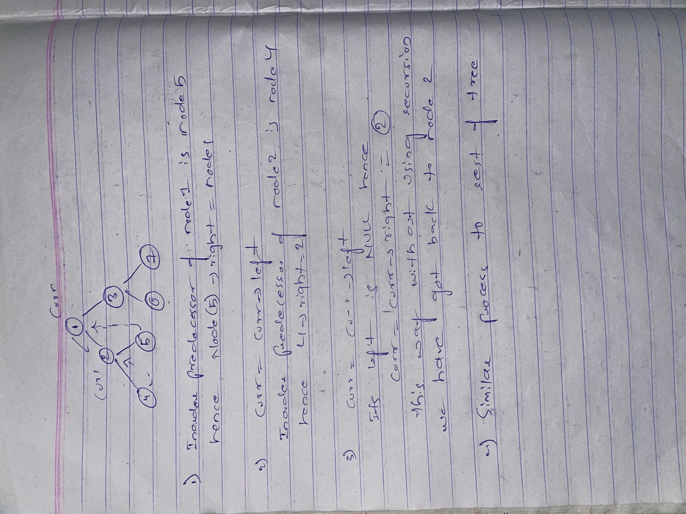

Approach

    1.All the 4 traversals of trees(inorder,preorder,postorder and levelorder) use O(n) time and space wher n= no of nodes

    2.The objective of this traversal is to traverse the tree in constant space

    3.The main intuition of this algorithm is that in all other traversals we get back to the curr node using recursion 

    hence if we can figure out a way to come back to current node without recursion we can meet the objective of this traversal

    4.To do the same we create temporary links from the inorder predecessor of current node to the current node

    5.After we have got back using the temporary link we remove it(make it NULL)

For better understanding take a look below

